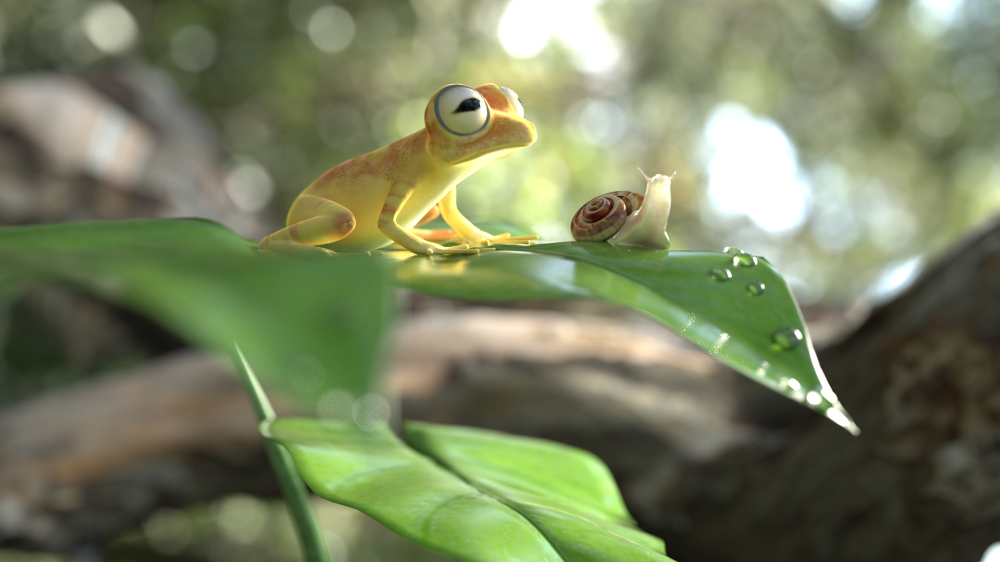
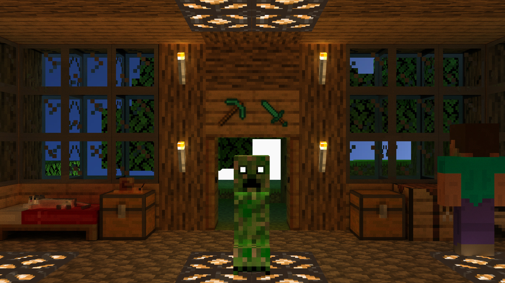

# WIP

## Physically Based Translucency 

Implemented by [Daniel Sanz](https://github.com/dsanz23) and me for the Modeling and Simulation of Appearence course, as an extension of the [Nori 2](https://rgl.epfl.ch/software/Nori2) C++ educational renderer. Our extensions included:
- A path tracer integrator
- Multiple Importance Sampling of BRDFs
- Microfacet BRDFs based on the Beckmann distribution
- Depth of Field simulation
- Translucent materials

We implemented translucency following the paper ['A Rapid Hierarchical Rendering Technique for Translucent Materials'](http://graphics.ucsd.edu/~henrik/papers/fast_bssrdf/fast_bssrdf.pdf) by Henrik Wann Jensen and Juan Buhler. The algorithm consists of a two-step rendering process:
- **Irradiance caching**, points are uniformly distributed through the mesh, and irradiance is obtained by integrating incoming radiance on the hemisphere. Those values are organized in an octree and serialized to a binary file.
- **Render step**, when the integrator intersects with a translucent mesh, it queries the octree to efficently compute the contribution coming from internally scattered light rays.

Our final image for the course won the [render competition](https://webdiis.unizar.es/~amunoz/en/render_cgr.html) (tied for first place):

This project is currently closed source, as it implements solutions to the coursework of [EPFL's Advanced Computer Graphics](https://rgl.epfl.ch/courses/ACG24), but I can share the code if you are interested. 

## C++ Path Tracer & Photon Mapper

[[Source]](https://github.com/genguita/cpp-PathTracer) Implemented by [Jorge Grima](https://github.com/JorgeGrima) and me for the Informática Gráfica course. The project consist of a ray-tracer baser renderer implemented in C++ from scratch, without the use of external libraries (except the octree, provided by the faculty). The main features of the project are:
- Implementation of a path tracer for global illumination.
- Implementation of a photon mapper for improved convergence of caustics.
- Implementation of a tone-mapper.
- Implementation of a Bounding Volume Hierarchy for ray-tracing acceleration.
- Multi-threaded rendering.
- Loading of 3D models and textures.

As our final image, we rendered the interior of a Minecraft house. To do so, we built the house in game and exported the 3D model to then render it with our path tracer.

