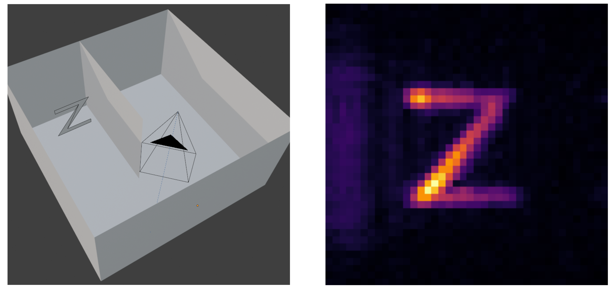
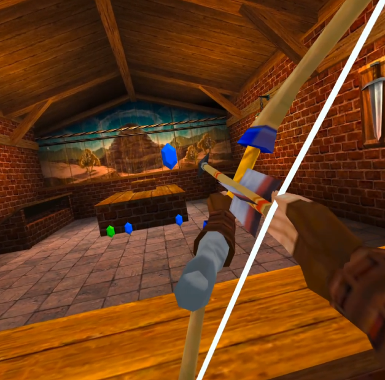

Here you can check some of the projects I have made or contributed to! 🐱

## mitransient

{: width="200" .right}

I am a contributor to the [mitransient](https://github.com/diegoroyo/mitransient) library, which extends the [Mitsuba 3](https://github.com/mitsuba-renderer/mitsuba3) 
rendering framework for transient light transport simulations, that is, simulating how light propagates through time.
By doing so, we can take into account the time of flight of each light path, resulting in renders that show how the light
propagates through the 3D scene.
        
One of the main applications of the library is simulating non-line-of-sight (NLOS) captures, that manage to see
around corners by leveraging transient light transport. NLOS imaging algorithms analyze how light bounces from a surface
and reconstruct the geometry that would be visible from it, even if there is an occluder between the geometry and the sensor.

The library is developed and maintained by students of the [Graphics & Imaging Lab](https://graphics.unizar.es/), 
and used for research projects both in the laboratory and in other universities.

## y-tal

I am also a contributor to the [y-tal](https://github.com/diegoroyo/tal) library (also developed in the [Graphics & Imaging Lab](https://graphics.unizar.es/)), which provides functionalities for NLOS imaging research, mainly:
- Simulation of NLOS capture data, using mitransient as the transient rendering backend.
- Reconstruction algorithms, mainly Backprojection, Phasor Fields and f-k migrations.
- Noise simulation tools, that mimic real transient sensors (Single Photon Avalanche Diodes).

    {: width="750"}
_Left: NLOS setup, the Z is not visible from the cameras POV. Right: reconstruction of the Z._

## Ocarina of Time (VR) Shooting Range
{: width="250" .right}
Implemented by [Daniel Sanz](https://github.com/dsanz23) and me as the final project of the master's [Virtual Reality](https://estudios.unizar.es/estudio/asignatura?anyo_academico=2025&asignatura_id=69157&estudio_id=20250713&centro_id=110&plan_id_nk=615) course.
The game lets you play Ocarina of Time's (3DS version) Shooting Gallery minigame with your VR headset.
Using Link's bow and arrows, your objective is to destroy all the moving rupees that appear.

To stay faithful to the original game, we extracted all the 3D assets from a decrypted ROM (except the shopkeeper, we couldn't find him 😓)
and then imported them to Unity, to setup the original scene and program the gameplay.

> Check out the [repository](https://github.com/genguita/OOT-ShootingGallery-VR)! You can download it and play with the Windows or Meta Quest 2 builds, you can also build it for other headsets from the Unity project.

## Physically Based Translucency 

Implemented by [Daniel Sanz](https://github.com/dsanz23) and me for the master's [Modeling and Simulation of Appearence](https://estudios.unizar.es/estudio/asignatura?anyo_academico=2025&asignatura_id=69153&estudio_id=20250713&centro_id=110&plan_id_nk=615) course, as an extension of the [Nori 2](https://rgl.epfl.ch/software/Nori2) C++ educational renderer. Our extensions included:
- A path tracer integrator
- Multiple Importance Sampling of BRDFs
- Microfacet BRDFs based on the Beckmann distribution
- Depth of Field simulation
- Translucent materials

We implemented translucency following the paper ['A Rapid Hierarchical Rendering Technique for Translucent Materials'](https://dl.acm.org/doi/10.1145/566654.566619) by Henrik Wann Jensen and Juan Buhler. The algorithm consists of a two-step rendering process:
- **Irradiance caching**, points are uniformly distributed through the mesh, and irradiance is obtained by integrating incoming radiance on the hemisphere. Those values are organized in an octree and serialized to a binary file.
- **Render step**, when the integrator intersects with a translucent mesh, it queries the octree to efficently compute the contribution coming from internally scattered light rays.

{: width="700"}
_Our final image for the course won the [render competition](https://webdiis.unizar.es/~amunoz/en/render_cgr.html) (tied for first place)._

> This project is currently closed source, as it implements solutions to the coursework of [EPFL's Advanced Computer Graphics](https://rgl.epfl.ch/courses/ACG24), but I can share the code if you are interested. 

## C++ Path Tracer & Photon Mapper

Implemented by [Jorge Grima](https://github.com/JorgeGrima) and me for the [Informática Gráfica](https://estudiosformacion.unizar.es/estudio/asignatura?anyo_academico=2025&asignatura_id=30234&estudio_id=20250148&centro_id=110&plan_id_nk=439) course. The project consist of a ray-tracer baser renderer implemented in C++ from scratch, without the use of external libraries (except the octree, provided by the faculty). The main features of the project are:
- Implementation of a path tracer for global illumination.
- Implementation of a photon mapper for improved convergence of caustics.
- Implementation of a tone-mapper.
- Implementation of a Bounding Volume Hierarchy for ray-tracing acceleration.
- Multi-threaded rendering.
- Loading of 3D models and textures.

{: width="700"}
_As our final image, we rendered the interior of a Minecraft house. To do so, we built the house in game and exported the 3D model to then render it with our path tracer._
> Check out the [repository](https://github.com/genguita/cpp-PathTracer)!